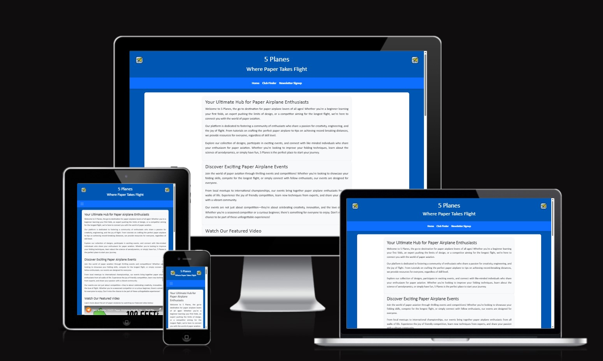

# 5 Planes  

## The Origami of Flight  

5 Planes is a website dedicated to the art and science of paper airplanes. It serves as a hub for enthusiasts of all ages, offering resources, tutorials, and a platform to connect with like-minded individuals. Whether you're a beginner learning your first folds or an expert aiming for record-breaking flights, 5 Planes is the perfect place to start your journey.  

Visit the deployed website [here](https://mcbonuss.github.io/5-Planes/).  

---

## Table of Contents  

1. Project Description  
2. User Experience (UX)  
    1. Project Goals  
    2. User Stories  
    3. Color Scheme  
    4. Typography  
    5. Wireframes  
3. Features  
    1. General  
    2. Landing Page  
    3. Club Finder Page  
    4. Newsletter Signup Page  
4. Technologies Used  
    1. Languages Used  
    2. Frameworks, Libraries, and Programs Used  
5. Testing  
    1. Testing User Stories  
    2. Code Validation  
    3. Accessibility  
    4. Manual Testing  
6. Deployment  
7. Credits  
    1. Content  
    2. Media  
    3. Code  
8. Acknowledgements  
9. Future Enhancements  
10. Contacts  

---

## Project Description  

5 Planes is a user-centric front-end development project designed to present static data in an engaging and visually appealing way. The website provides information about paper airplane designs, tutorials, and events, while also connecting users to local clubs and communities.  

---

## User Experience (UX)  

### Project Goals  

- Provide a visually appealing and user-friendly website for paper airplane enthusiasts.  
- Offer resources, tutorials, and event information to foster a community of hobbyists.  
- Encourage users to connect with local clubs and participate in events.  

### User Stories  

- **As a user**, I want to learn how to fold paper airplanes through tutorials.  
- **As a user**, I want to find local clubs to connect with other enthusiasts.  
- **As a user**, I want to sign up for a newsletter to stay updated on events and tips.  
- **As a user**, I want to view upcoming events and competitions.  
- **As a user**, I want the website to be responsive and easy to navigate on any device.  

### Color Scheme  

The website uses a blue and white color scheme to evoke a sense of calm and creativity.  

### Typography  

The primary font is **Gill Sans**, with fallback fonts for compatibility.  

---

## Features  

### General  

- Fully responsive design for all devices.

### Wireframes  

The initial wireframe for the website can be found below:  
  

## Responsive design



- Consistent navigation bar across all pages.  
- Footer with social media links and copyright information.  

### Landing Page  

- **Introduction**: A welcoming section introducing the world of paper airplanes.  
- **Featured Video**: A video showcasing the art of paper airplanes.  
- **Upcoming Events**: A section highlighting upcoming events with details and dates.  

### Club Finder Page  

- **Grid Layout**: Displays paper airplane clubs across Europe in a visually appealing grid.  
- **Contact Links**: Clickable email links for contacting clubs.  

### Newsletter Signup Page  

- **Signup Form**: A form for users to subscribe to the newsletter.  
- **Gallery**: A Lightbox gallery showcasing folding techniques.  

---

## Technologies Used  

### Languages Used  

- **[HTML5](https://developer.mozilla.org/en-US/docs/Web/HTML)**: For structuring content.  
- **[CSS3](https://developer.mozilla.org/en-US/docs/Web/CSS)**: For styling and layout.  

### Frameworks, Libraries, and Programs Used  

- **[Bootstrap](https://getbootstrap.com/)**: For responsive design and layout.  
- **[Font Awesome](https://fontawesome.com/)**: For social media icons.  
- **[Lightbox2](https://lokeshdhakar.com/projects/lightbox2/)**: For the gallery feature.  
- **[Google Fonts](https://fonts.google.com/)**: For typography.  
- **[GitHub Pages](https://pages.github.com/)**: For deployment.  

---

## Testing

#

### Testing Technologies Used in 5 Planes

The following tools and technologies were used to test the project:  

- **[W3C Markup Validator](https://validator.w3.org/)**: Used to validate the HTML code for syntax errors and best practices.  
- **[W3C CSS Validator](https://jigsaw.w3.org/css-validator/)**: Used to validate the CSS code for syntax errors and ensure proper styling practices.  
- **[Lighthouse (Chrome DevTools)](https://developers.google.com/web/tools/lighthouse/)**: Used to test the website's performance, accessibility, best practices, and SEO.  
- **[Responsive Design Checker](https://www.responsivedesignchecker.com/)**: Used to test the responsiveness of the website on various screen sizes and devices.  
- **Manual Testing**: Conducted across multiple browsers and devices to ensure functionality and responsiveness.  
- **Email Client Testing**: Tested email links to ensure they open the user's default email client with the correct recipient.  

---

### Testing User Stories  

1. **Learn how to fold paper airplanes**:  
   - Tutorials are accessible on the landing page and provide clear instructions.  
   - Links to additional resources are functional.  

2. **Find local clubs**:  
   - Club Finder page lists clubs with accurate contact details.  
   - Email links open the user's default email client.  

3. **Sign up for the newsletter**:  
   - Newsletter Signup page includes a functional form with required fields.  
   - Form validation ensures proper email format before submission.  

4. **View upcoming events**:  
   - Events are displayed on the landing page with accurate dates and descriptions.  

5. **Responsive design**:  
   - Tested on multiple devices and screen sizes to ensure proper layout and functionality.  

---

### Code Validation  

- **HTML**: Validated using [W3C Markup Validator](https://validator.w3.org/).  
- **CSS**: Validated using [W3C CSS Validator](https://jigsaw.w3.org/css-validator/).  
- Screenshots of validation results are included in the projectscreenshots folder.  

---

### Accessibility  

- Tested with Lighthouse in Chrome DevTools to ensure good accessibility scores.  
- Ensured proper color contrast and semantic HTML for screen readers.  
| Test        | Proof                                                                | Pass/Fail |
|-------------------|-------------------------------------------------------------------------|-----------|
| W3C Markup Validator    | assets/images/screenshots/index-html-wc3test.jpg               | Pass      |
| W3C CSS Validator | assets/images/screenshots/w3c-css-validator.jpg               | Pass      |

---

### Manual Testing  

#### Browser Compatibility  

| Browser           | Outcome                                                                 | Pass/Fail |
|-------------------|-------------------------------------------------------------------------|-----------|
| Google Chrome     | No appearance, responsiveness, or functionality issues.               | Pass      |
| Safari            | No appearance, responsiveness, or functionality issues.               | Pass      |
| Mozilla Firefox   | Scrollbar is visible even though it should be hidden. No major issues. | Pass      |
| Microsoft Edge    | No appearance, responsiveness, or functionality issues.               | Pass      |

---

#### Device Compatibility  

| Device                | Outcome                                                                 | Pass/Fail |
|-----------------------|-------------------------------------------------------------------------|-----------|
| MacBook Pro 15"       | No appearance, responsiveness, or functionality issues.               | Pass      |
| Dell Latitude 5300    | No appearance, responsiveness, or functionality issues.               | Pass      |
| iPad Pro 12.9"        | No appearance, responsiveness, or functionality issues.               | Pass      |
| iPad Pro 10.5"        | No appearance, responsiveness, or functionality issues.               | Pass      |
| iPhone XR             | No appearance, responsiveness, or functionality issues.               | Pass      |
| iPhone 7              | No appearance, responsiveness, or functionality issues.               | Pass      |

---

#### Common Elements Testing  

##### Site-wide

| Feature                  | Outcome                                                                 | Pass/Fail |
|--------------------------|-------------------------------------------------------------------------|-----------|
| Navigation Bar           | Hover effect and links are working as expected.                       | Pass      |
| Social Links             | Open the specific website on a new tab.                               | Pass      |
| Footer                   | Displays correctly on all pages with functional links.                | Pass      |

##### Landing Page Testing

| Feature                  | Outcome                                                                 | Pass/Fail |
|--------------------------|-------------------------------------------------------------------------|-----------|
| Featured Video           | Video loads and plays correctly.                                       | Pass      |
| Upcoming Events Section  | Displays accurate event details with proper formatting.                | Pass      |

##### Club Finder Page Testing

| Feature                  | Outcome                                                                 | Pass/Fail |
|--------------------------|-------------------------------------------------------------------------|-----------|
| Club Grid Layout         | Displays clubs in a visually appealing grid format.                    | Pass      |
| Email Links              | Open the user's default email client with the correct recipient.       | Pass      |

##### Newsletter Signup Page Testing

| Feature                  | Outcome                                                                 | Pass/Fail |
|--------------------------|-------------------------------------------------------------------------|-----------|
| Signup Form              | Requires all fields to be filled in the correct format before submission. | Pass      |
| Form Validation          | Displays error messages for invalid inputs.                            | Pass      |
| Form Validation          | returns first and last name as well as email.                            | Pass      |

---

#### 404 Error Page  

| Feature                  | Outcome                                                                 | Pass/Fail |
|--------------------------|-------------------------------------------------------------------------|-----------|
| 404 Error Page           | Entering an incorrect URL redirects to the 404 error page.             | Pass      |
| Back to Home Button      | Button redirects to the home page as expected.                         | Pass      |

---

### Comments  

- All features were tested thoroughly across multiple devices and browsers.  
- Minor issues, such as the visible scrollbar in Firefox, were noted but not addressed due to their negligible impact on user experience.  
- The website is fully functional and responsive, meeting the project goals and user stories.

---

## Deployment  

This website was developed using **Visual Studio Code**, committed and pushed to **GitHub** using the terminal, and deployed to **GitHub Pages** from the GitHub repository.

### Deploying on GitHub Pages  

To deploy this website to GitHub Pages from its GitHub repository, follow these steps:

1. **Log into GitHub**:  
   - Ensure you are logged into your GitHub account.

2. **Navigate to the Repository**:  
   - Go to the repository for this project: [5-Planes Repository](https://github.com/mcbonuss/5-Planes).

3. **Access the Settings**:  
   - At the top-right corner of the repository page, click on the **Settings** tab.

4. **Open the Pages Section**:  
   - On the left-hand side of the page, under **Code and automation**, click on **Pages**.

5. **Configure Deployment Source**:  
   - Under the **Build and deployment** section, locate the **Source** dropdown menu.  
   - Select **Deploy from a branch**.

6. **Select the Branch**:  
   - Under the **Branch** dropdown, select the branch you want to deploy (e.g., `main`).  
   - Ensure the folder is set to `/root`.

7. **Save and Deploy**:  
   - Click the **Save** button.  

8. **Wait for Deployment**:  
   - After a few moments, refresh the page. A link to your deployed website will appear in the **GitHub Pages** section.  

The live website is now available at: [https://mcbonuss.github.io/5-Planes/](https://mcbonuss.github.io/5-Planes/).

---

### Forking the Repository  

Forking a GitHub repository creates a copy of the original repository in your GitHub account. This allows you to view or make changes without affecting the original repository.  

To fork this repository:  

1. **Log into GitHub**:  
   - Ensure you are logged into your GitHub account.  

2. **Locate the Repository**:  
   - Navigate to the [5-Planes Repository](https://github.com/mcbonuss/5-Planes).  

3. **Fork the Repository**:  
   - At the top-right corner of the repository page, click the **Fork** button.  

You now have a copy of the original repository in your GitHub account.  

---

### Creating a Clone  

To run this project locally, you can clone the repository to your local machine. Follow these steps:  

1. **Log into GitHub**:  
   - Ensure you are logged into your GitHub account.  

2. **Locate the Repository**:  
   - Navigate to the [5-Planes Repository](https://github.com/mcbonuss/5-Planes).  

3. **Copy the Clone URL**:  
   - Click the green **Code** button and copy the HTTPS clone URL (e.g., `https://github.com/mcbonuss/5-Planes.git`).  

4. **Open Your IDE**:  
   - Open your preferred IDE (e.g., Visual Studio Code).  

5. **Open the Terminal**:  
   - In your IDE, open the terminal.  

6. **Navigate to Your Desired Directory**:  
   - Use the `cd` command to navigate to the directory where you want to clone the project.  

7. **Clone the Repository**:  
   - Run the following command:  

     ```bash
     git clone https://github.com/mcbonuss/5-Planes.git
     ```  

8. **Open the Project**:  
   - Once cloned, open the project folder in your IDE.  

9. **Run the Project**:  
   - Open the `index.html` file in your browser to view the project locally.  

---

### Troubleshooting  

If you encounter any issues during deployment or local setup, refer to the following resources:  

- [GitHub Pages Documentation](https://docs.github.com/en/pages)  
- [Cloning a Repository](https://docs.github.com/en/repositories/creating-and-managing-repositories/cloning-a-repository)  

For further assistance, feel free to contact me via the details provided in the [Contacts](#contacts) section.

---

## Credits  

### Content  

- All content was written by RM, Code Institute, Bootstrap, Et al.  

### Media  

- Images were sourced from free repositories or generated using DALLE.  

### Code  

- Inspiration and guidance from Code Institute and Stack Overflow.  

---

## Acknowledgements  

- Code Institute for project guidance.  
- Family and friends for feedback and support.
- Sheralyn for being supportive and keeping me motivated.

---

## Future Enhancements  

- **Interactive Tutorials**: Add step-by-step interactive tutorials for folding paper airplanes.  
- **Club Finder Map**: Embed a Google Map to show club locations visually.  
- **User Accounts**: Allow users to create accounts to save their favorite designs and clubs.  
- **Event Registration**: Add functionality for users to register for events directly on the site.  

---

## Contacts  

For any questions or feedback, please contact:  

- **Name**: Russ M  
- **Email**: <rmckeith@gmail.com>  
- **GitHub**: [https://github.com/mcbonuss](https://github.com/mcbonuss)
- **GitHub**: Forking the repository  
