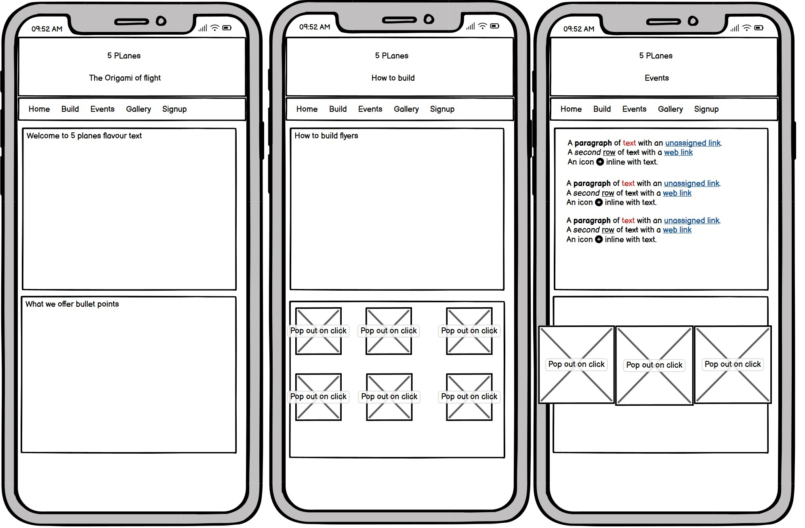
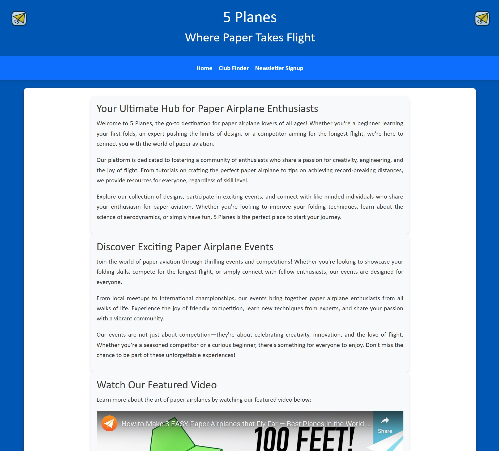
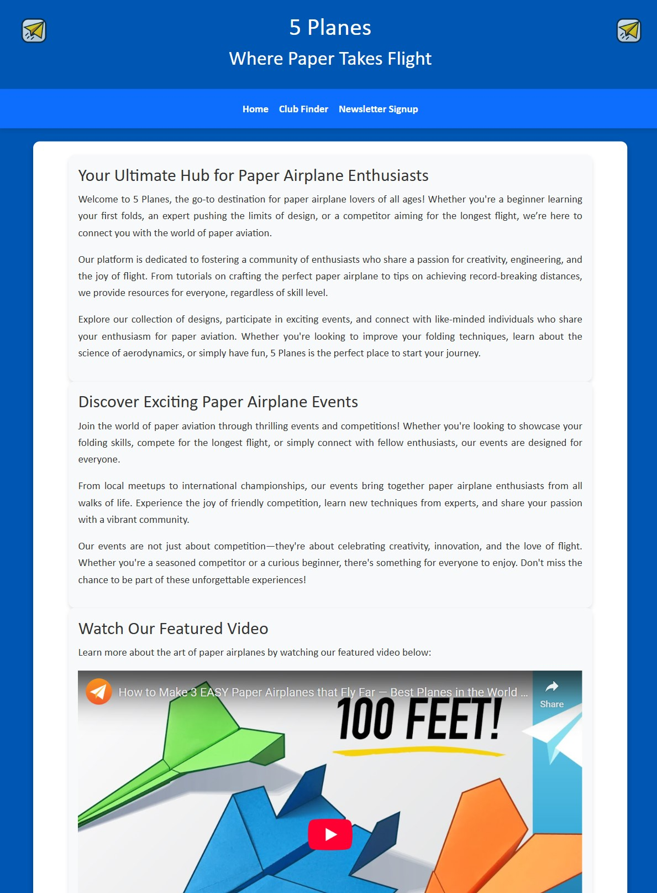
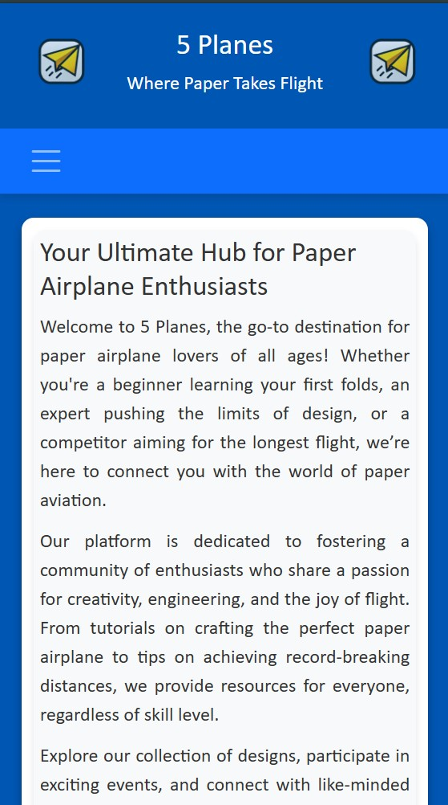

# 5 Planes  

## The Origami of Flight  

## Our Original Mockup

 

## Responsive design

### Full Size

### Tablet

### Mobile

5 Planes is a website dedicated to the art and science of paper airplanes. It serves as a hub for enthusiasts of all ages, offering resources, tutorials, and a platform to connect with like-minded individuals. Whether you're a beginner learning your first folds or an expert aiming for record-breaking flights, 5 Planes is the perfect place to start your journey.  

Visit the deployed website [here](https://mcbonuss.github.io/5-Planes/).  

---

## Table of Contents  

1. Project Description  
2. User Experience (UX)  
    1. Project Goals  
    2. User Stories  
    3. Color Scheme  
    4. Typography  
    5. Wireframes  
3. Features  
    1. General  
    2. Landing Page  
    3. Club Finder Page  
    4. Newsletter Signup Page  
4. Technologies Used  
    1. Languages Used  
    2. Frameworks, Libraries, and Programs Used  
5. Testing  
    1. Testing User Stories  
    2. Code Validation  
    3. Accessibility  
    4. Manual Testing  
6. Deployment  
7. Credits  
    1. Content  
    2. Media  
    3. Code  
8. Acknowledgements  
9. Future Enhancements  
10. Contacts  

---

## Project Description  

5 Planes is a user-centric front-end development project designed to present static data in an engaging and visually appealing way. The website provides information about paper airplane designs, tutorials, and events, while also connecting users to local clubs and communities.  

---

## User Experience (UX)  

### Project Goals  

- Provide a visually appealing and user-friendly website for paper airplane enthusiasts.  
- Offer resources, tutorials, and event information to foster a community of hobbyists.  
- Encourage users to connect with local clubs and participate in events.  

### User Stories  

- **As a user**, I want to learn how to fold paper airplanes through tutorials.  
- **As a user**, I want to find local clubs to connect with other enthusiasts.  
- **As a user**, I want to sign up for a newsletter to stay updated on events and tips.  
- **As a user**, I want to view upcoming events and competitions.  
- **As a user**, I want the website to be responsive and easy to navigate on any device.  

### Color Scheme  

The website uses a blue and white color scheme to evoke a sense of calm and creativity.  

### Typography  

The primary font is **Gill Sans**, with fallback fonts for compatibility.  

### Wireframes  

The initial wireframe for the website can be found below:  
!Wireframe  

---

## Features  

### General  

- Fully responsive design for all devices.  
- Consistent navigation bar across all pages.  
- Footer with social media links and copyright information.  

### Landing Page  

- **Introduction**: A welcoming section introducing the world of paper airplanes.  
- **Featured Video**: A video showcasing the art of paper airplanes.  
- **Upcoming Events**: A section highlighting upcoming events with details and dates.  

### Club Finder Page  

- **Grid Layout**: Displays paper airplane clubs across Europe in a visually appealing grid.  
- **Contact Links**: Clickable email links for contacting clubs.  

### Newsletter Signup Page  

- **Signup Form**: A form for users to subscribe to the newsletter.  
- **Gallery**: A Lightbox gallery showcasing folding techniques.  

---

## Technologies Used  

### Languages Used  

- **HTML5**: For structuring content.  
- **CSS3**: For styling and layout.  

### Frameworks, Libraries, and Programs Used  

- **Bootstrap**: For responsive design and layout.  
- **Font Awesome**: For social media icons.  
- **Lightbox2**: For the gallery feature.  
- **Google Fonts**: For typography.  
- **GitHub Pages**: For deployment.  

---

## Testing  

### Testing User Stories  

1. **Learn how to fold paper airplanes**:  
   - Tutorials are accessible on the landing page.  
2. **Find local clubs**:  
   - Club Finder page lists clubs with contact details.  
3. **Sign up for the newsletter**:  
   - Newsletter Signup page includes a functional form.  
4. **View upcoming events**:  
   - Events are displayed on the landing page.  
5. **Responsive design**:  
   - Tested on multiple devices and screen sizes.  

### Code Validation  

- HTML validated using [W3C Markup Validator](https://validator.w3.org/).  
- CSS validated using [W3C CSS Validator](https://jigsaw.w3.org/css-validator/).  

### Accessibility  

- Tested with Lighthouse in Chrome DevTools to ensure good accessibility scores.  

### Manual Testing  

- Navigation links tested for functionality.  
- Forms tested for validation and submission.  
- Images and videos tested for responsiveness.  

---

## Deployment  

The project was deployed using GitHub Pages:  

1. Push the project to a GitHub repository.  
2. Go to the repository's settings.  
3. Under the "Pages" section, select the branch (e.g., `main`) and folder (e.g., `/root`) to deploy.  
4. Save the settings, and the website will be available at `https://<your-username>.github.io/<repository-name>`.  

---

## Credits  

### Content  

- All content was written by the developer.  

### Media  

- Images were sourced from free repositories or generated using DALLE.  

### Code  

- Inspiration and guidance from Code Institute and Stack Overflow.  

---

## Acknowledgements  

- Code Institute for project guidance.  
- Family and friends for feedback and support.  

---

## Future Enhancements  

- **Interactive Tutorials**: Add step-by-step interactive tutorials for folding paper airplanes.  
- **Club Finder Map**: Embed a Google Map to show club locations visually.  
- **User Accounts**: Allow users to create accounts to save their favorite designs and clubs.  
- **Event Registration**: Add functionality for users to register for events directly on the site.  

---

## Contacts  

For any questions or feedback, please contact:  

- **Name**: Russ M  
- **Email**: <rmckeith@gmail.com>  
- **GitHub**: [https://github.com/mcbonuss](https://github.com/mcbonuss)  

---

### Key Improvements Made

1. Added a **Future Enhancements** section to show forward-thinking.
2. Improved the **Testing** section with more details and links to Lighthouse results.
3. Enhanced the **Features** section with more descriptive content.
4. Organized the **Credits** and **Acknowledgements** sections for clarity.
5. Ensured the README follows a professional structure with clear headings and subheadings.

Let me know if you need further refinements!
